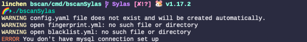
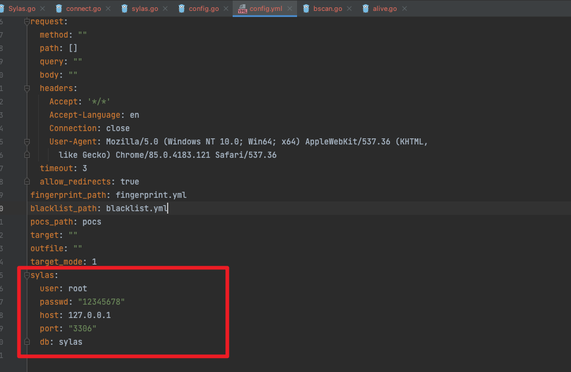

# BSCAN-Sylas

> bscan的是一款强大、简单、实用、高效的HTTP扫描器。

更多的关于Bscan强大的功能介绍请移步到https://github.com/broken5/bscan

此处用来介绍Bscan与[Sylas](https://github.com/Acmesec/Sylas)的配置方法

这个版本与bscan原版本代码没有区别，我只是修改了一些地方。使bscan可以作为服务来启动。该版本同样可以作为bscan正常的功能启用，启用方法与主支的方法一般无二。

## 配置方法

### 0x00 初始化

首先是第一步，直接启动一次bscan，这样会报错并且生成配置文件且同时会报错需要配置Mysql

```shell
./bscanSylas
```





### 0x01 修改Config.yml文件

打开Config.yml文件



将此处关于塞拉斯的配置。

### 0x02 启动

直接以nohup去启动本程序。

```shell
nohup ./bscanSylas &
```

程序将在每1分钟自动拉取塞拉斯数据库，进行扫描之后将扫描结果储存在数据库中，以供塞拉斯去拉取。

